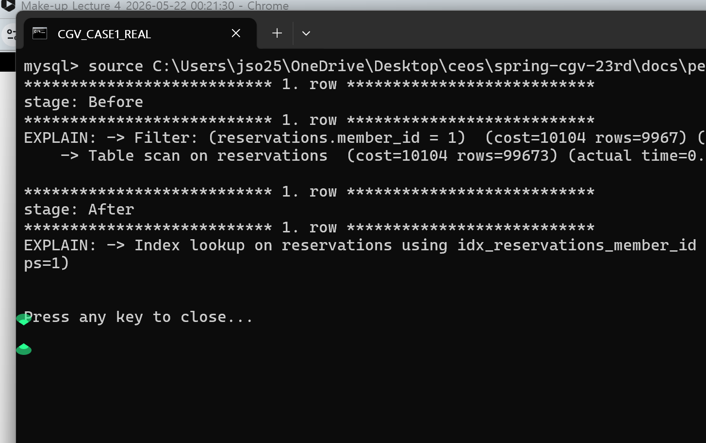
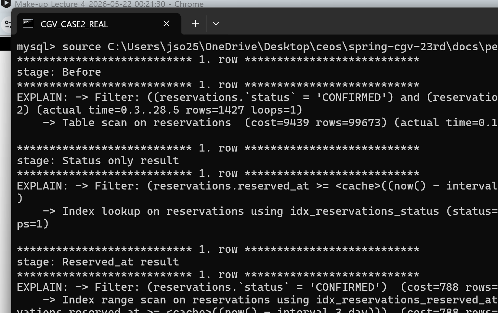
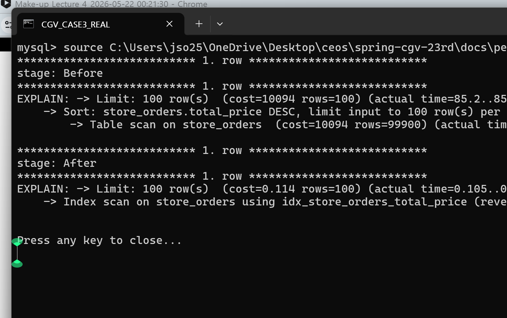
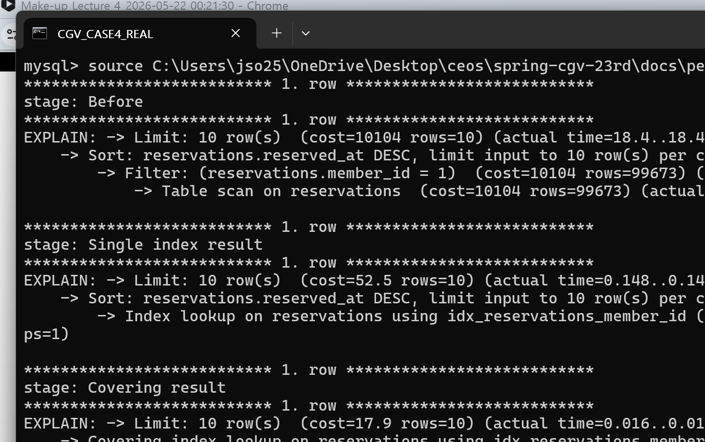

# spring-cgv-23rd

## 1️⃣ 트랜잭션 전파 속성 더 찾아보기

`REQUIRED`, `REQUIRES_NEW` 말고도 Spring에는 전파 속성이 더 있음.  
공식 문서 기준으로 전파 옵션은 총 7개고, 수업에서 안 다룬 나머지 5개는 아래처럼 보면 됨.

### `SUPPORTS`

: 이미 트랜잭션이 있으면 거기에 같이 참여하고, 없으면 그냥 트랜잭션 없이 실행

- 조회성 로직에서 "있으면 같이 타고 가고, 없어도 굳이 새로 만들진 않음" 정도로 쓰기 좋음
- 대신 호출 위치에 따라 동작이 달라져서, 핵심 쓰기 로직에 쓰면 오히려 헷갈릴 수 있음

### `MANDATORY`

: 반드시 기존 트랜잭션이 있어야 함. 없으면 바로 예외 발생

- 상위 서비스가 연 트랜잭션 안에서만 돌아야 하는 내부 메서드에 사용
- "이 메서드는 단독 실행하면 안 됨"을 코드로 강하게 표현하는 느낌에 가까움

### `NOT_SUPPORTED`

: 트랜잭션 없이 실행. 바깥에 트랜잭션이 있으면 잠깐 멈춰두고 이 메서드만 비트랜잭션으로 동작

- 오래 걸리는 외부 API 호출, 파일 처리, 단순 조회처럼 굳이 트랜잭션으로 묶을 필요 없는 작업에 고려할 수 있음
- 대신 여기서 실패한 내용을 바깥 트랜잭션 롤백으로 같이 되돌리는 건 기대하면 안 됨

### `NEVER`

: 트랜잭션 없이만 실행. 그런데 이미 트랜잭션이 열려 있으면 예외 발생

- `NOT_SUPPORTED`보다 더 강하게 제약을 거는 옵션
- "이 작업은 트랜잭션 안에서 돌면 안 됨"을 분명하게 막고 싶을 때 사용
- 실무에서 엄청 자주 보이진 않고, 의도를 강하게 드러낼 때 쓰는 편

### `NESTED`

: 기존 트랜잭션 안에서 `savepoint`를 잡고, 안쪽 작업만 부분 롤백할 수 있음. 바깥 트랜잭션이 없으면 `REQUIRED`처럼 동작

- `REQUIRES_NEW`처럼 물리 트랜잭션을 아예 분리하는 방식은 아님
- 안쪽 작업이 실패하면 그 지점까지만 되돌리고, 바깥 작업은 계속 진행할 수 있음
- 하지만 바깥 트랜잭션이 마지막에 롤백되면 안쪽에서 성공했던 작업도 결국 같이 롤백됨
- `savepoint` 지원이 필요해서 환경 따라 바로 못 쓰는 경우도 있음

### 헷갈리기 쉬운 차이

#### `REQUIRES_NEW` vs `NESTED`

- `REQUIRES_NEW`
  - 아예 새 물리 트랜잭션을 만듦
  - 안쪽 커밋/롤백이 바깥 트랜잭션과 분리됨
- `NESTED`
  - 같은 물리 트랜잭션 안에서 `savepoint`만 나눔
  - 부분 롤백은 되지만, 최종 결과는 바깥 트랜잭션에 영향을 받음

### 한 번에 정리

| 속성 | 기존 트랜잭션이 있으면 | 없으면 |
| --- | --- | --- |
| `SUPPORTS` | 기존 트랜잭션 참여 | 그냥 실행 (트랜잭션 없음) |
| `MANDATORY` | 기존 트랜잭션 참여 | 예외 발생 |
| `NOT_SUPPORTED` | 기존 트랜잭션 일시 중단 | 그냥 실행 (트랜잭션 없음) |
| `NEVER` | 예외 발생 | 그냥 실행 (트랜잭션 없음) |
| `NESTED` | `savepoint` 기반 중첩 처리 | `REQUIRED`처럼 새 트랜잭션 시작 |

### 정리

- 왜 `REQUIRED`가 기본값인지 좀 이해됐음. 대부분 서비스 로직은 "있으면 합류, 없으면 시작"이 제일 자연스러움
- 나머지 전파 옵션들은 편한 기능이라기보다, "이 메서드는 어떤 경계 안에서 돌아야 하냐"를 코드로 드러내는 용도에 더 가까웠음
- 특히 `NESTED`는 이름만 보면 `REQUIRES_NEW`랑 비슷해 보이는데, 실제 동작은 꽤 다름

## 2️⃣ 현재 CGV 서비스의 트랜잭션 분석

이번에는 "어디에 `@Transactional`이 붙어 있는지"만 본 게 아니라,  
그 경계가 지금 서비스 흐름이랑 잘 맞는지도 같이 봤음.

### 지금 구조는 어떻게 되어 있나

#### 조회 전용 서비스

- `MovieService`
- `CinemaService`
- `ScreeningQueryService`
- `SeatTemplateCacheService`
- `StoreQueryService`

위 서비스들은 클래스 레벨에서 `@Transactional(readOnly = true)`를 사용하고 있었음.  
조회가 목적이 분명해서 방향 자체는 괜찮았음.

#### 쓰기 중심 서비스

- `AuthService`
- `ReservationService`
- `PaymentService`
- `StorePurchaseService`
- `MovieLikeService`
- `CinemaLikeService`

여기는 생성, 수정, 삭제가 들어가니까 트랜잭션을 여는 방향이 자연스러웠음.

### 괜찮았던 점

#### 1. 조회 서비스에 `readOnly = true`를 붙여둔 건 적절했음

- 상영 조회, 좌석 조회, 매점 메뉴 조회처럼 read 비중이 큰 서비스는 `readOnly = true`가 잘 맞음
- 의미도 분명하고, JPA 입장에서도 "여긴 수정 의도 없음"을 알려주는 셈이라 관리가 깔끔했음

#### 2. 예매 / 결제 / 좌석 처리 흐름을 한 트랜잭션으로 묶은 건 맞는 방향이었음

예를 들면 `ReservationService.createReservation()`에서는

1. 예매 생성
2. 좌석 점유 저장
3. 결제 로그 생성

이 세 단계가 같이 묶여 있음.

- 이건 한 단계라도 실패하면 전부 롤백되어야 하는 흐름이라서 트랜잭션 경계가 적절했음
- `cancelReservation()`, `confirmPayment()`도 비슷하게 예매 상태와 결제 상태를 같이 바꾸고 있어서 분리하는 것보다 지금처럼 한 번에 묶는 쪽이 더 안전했음

#### 3. 동시성 이슈가 있는 곳은 락이 같이 들어가 있었음

- 예매 생성에서는 `Screening` 조회 시 `PESSIMISTIC_WRITE` 락 사용
- 매점 구매에서는 `CinemaMenuStock` 조회 시 `PESSIMISTIC_WRITE` 락 사용
- 좌석은 `reservation_seat` 유니크 제약까지 같이 걸려 있음

그래서 "트랜잭션만 열어둔 상태"가 아니라, 실제 충돌 가능성이 있는 자원에 대해서는 방어가 들어가 있었음.  
이건 꽤 괜찮았음.

### 아쉬웠던 점

#### 1. `AuthService.login()`이 `readOnly = true`인데 실제로는 쓰기를 하고 있었음

`login()`은 이름만 보면 조회처럼 보일 수 있는데, 실제로는 아래 작업을 같이 함.

- 사용자 조회
- 비밀번호 검증
- access token 발급
- refresh token 생성
- refresh token 저장 또는 갱신

즉, 마지막 단계에서 DB write가 발생함.  
그런데 메서드에는 `@Transactional(readOnly = true)`가 붙어 있었음.

이건 두 가지 면에서 애매했음.

- 의미상 read 메서드가 아님
- `readOnly`는 "쓰기 금지"가 아니라 최적화 힌트에 가까워서, 이런 식으로 써두면 나중에 보면 더 헷갈림

그래서 이 부분은 `@Transactional`로 바꾸는 게 맞다고 판단했고, 이번에 실제로 그렇게 수정했음.

#### 2. 조회 API까지 write 트랜잭션으로 열리고 있었음

`ReservationService`는 클래스에 `@Transactional(readOnly = true)`가 붙어 있는데,

- `getReservations()`
- `getReservation()`

이 두 메서드는 다시 `@Transactional`로 열고 있었음.

이유를 따라가 보니, 조회 전에 `expireOverdueReservations()`를 호출하고 있었기 때문이었음.

즉 지금 구조는

1. 조회 요청이 들어옴
2. 만료 예매 일괄 정리 실행
3. 결제 만료 처리
4. 좌석 점유 삭제
5. 그 다음에야 조회

이렇게 되어 있었음.

문제는 조회 하나 하려고 들어왔는데, 그 안에서 전혀 관계없는 만료 배치 작업까지 같이 태우고 있다는 점이었음.  
이러면 read API도 write transaction이 되고, 트랜잭션 범위도 필요 이상으로 커짐.

#### 3. 만료 처리 범위가 너무 넓었음

`expireOverdueReservations()`는 이름 그대로 "만료된 예약 전체"를 한 번에 훑는 메서드임.

그런데 이 메서드가

- `createReservation()`
- `getReservations()`
- `getReservation()`
- `cancelReservation()`
- `confirmPayment()`

이런 여러 요청의 시작점마다 호출되고 있었음.

이 방식의 아쉬운 점은,

- 어떤 사용자가 좌석 2개 예약하려고 들어와도
- 그 요청이 자기 예매만 처리하는 게 아니라
- 시스템 전체의 만료 예약 정리까지 같이 하게 된다는 점임

정합성 자체는 맞출 수 있어도, 요청 하나가 불필요하게 무거워짐.

#### 4. 만료 로직을 같은 서비스 안에 둔 것도 나중에 확장할 때 아쉬움

지금은 `ReservationService` 안에서 `expireOverdueReservations()`를 직접 호출하고 있음.

이 구조에서는 나중에

- 만료 처리는 별도 트랜잭션으로 돌리고 싶다거나
- `REQUIRES_NEW`를 써서 분리하고 싶다거나
- 배치성 정리 로직만 따로 관리하고 싶다거나

해도 바로 적용하기가 애매함.

같은 클래스 내부 호출은 스프링 프록시를 타지 않아서, 전파 옵션을 바꿔도 기대한 대로 안 먹을 수 있기 때문임.

### 왜 이런 구조가 들어갔을까?

조금 이해가 가는 부분도 있었음.

현재 예매 좌석은 `reservation_seat(screening_id, seat_template_id)` 유니크 제약으로 막고 있음.  
그래서 만료된 예약의 좌석 점유 레코드가 남아 있으면, 시간이 지났더라도 새 예매 insert가 막힐 수 있음.

즉 "만료됐으면 좌석 점유를 실제로 지워야 한다"는 요구가 있어서, 예매 전에 만료 정리를 넣어둔 것 같았음.

의도는 맞는데, 문제는 그걸 "전체 만료 예약 일괄 정리"로 풀어버렸다는 점이었음.

### 개선 방향

#### 1. 로그인은 readOnly를 빼는 게 맞음

- `AuthService.login()`
  - `@Transactional(readOnly = true)` -> `@Transactional`
- 이번에 이 부분은 실제로 수정했음

#### 2. 만료 처리는 조회 로직과 분리하는 게 좋겠음

내가 보기엔 방향은 아래 쪽이 더 나았음.

- 스케줄러는 전체 만료 예약 정리 전용으로 사용
- 사용자 요청에서는 "지금 요청에 필요한 범위만" 정리
- 조회 메서드는 다시 `readOnly = true` 성격으로 돌려놓기

예를 들면

- 예매 생성 전에는 "해당 상영관 / 해당 좌석 관련 만료 예약만" 정리
- 상세 조회 전에는 전체 배치를 돌리지 말고, 상태 계산만 하거나 필요한 예약만 확인

이런 식이 더 가벼움.

#### 3. 만료 로직은 별도 서비스로 빼는 편이 낫겠음

예를 들면

- `ReservationService`
  - 사용자 요청 처리 전용
- `ReservationExpirationService`
  - 만료 정리 전용

이렇게 나누면 역할이 분명해지고, 필요하면 나중에 `REQUIRES_NEW` 같은 전파 옵션도 붙이기 쉬워짐.

### 정리

- 전체적으로 봤을 때 "트랜잭션을 아예 엉뚱하게 걸어둔 프로젝트"는 아니었음
- 조회 서비스는 조회답게, 쓰기 서비스는 쓰기답게 나눠둔 편이었고
- 예매 / 결제 / 좌석 / 재고처럼 중요한 변경 로직은 트랜잭션으로 잘 묶여 있었음

다만 아쉬웠던 건 두 군데였음.

- `login()`이 readOnly였는데 실제로는 write를 하고 있던 점
- 예약 관련 요청마다 전역 만료 정리 로직을 같이 태우면서 트랜잭션 범위를 너무 넓혀둔 점

정리하면, 지금 구조는 "큰 방향은 맞는데, 경계가 조금 넓은 부분이 있다" 정도로 보는 게 제일 맞아 보였음.

## 3️⃣ 인덱스 종류 더 찾아보기

수업에서는 보통 "PK 인덱스", "일반 인덱스", "WHERE 빨라진다" 정도부터 시작하는데,  
실제로는 인덱스도 꽤 여러 종류가 있고, 각각 잘 맞는 상황이 다름.

특히 `커버링 인덱스`는 별도 문법이 있는 인덱스 종류라기보다,  
"이 쿼리에 필요한 데이터를 테이블까지 다시 안 가고 인덱스만 보고 끝낼 수 있는 상태"에 가까움.

### 먼저 큰 그림

MySQL 기준으로 보면

- 우리가 평소 가장 많이 쓰는 `PRIMARY KEY`, `UNIQUE`, `INDEX`는 대부분 `B-Tree` 기반
- `SPATIAL`은 공간 데이터용이라 `R-Tree` 계열
- `FULLTEXT`는 글 검색용
- `HASH` 인덱스는 보통 `MEMORY` 엔진에서나 이야기하고, 일반적인 InnoDB 서비스에서는 거의 `B-Tree`를 기본으로 생각하면 됨

즉 실무에서 제일 많이 보는 건 사실상 `B-Tree 인덱스들`이고,  
그 위에서 `단일`, `복합`, `유니크`, `커버링` 같은 식으로 나눠서 이해하는 편이 편했음.

### `클러스터드 인덱스`

: InnoDB에서 테이블 데이터 자체가 이 인덱스 순서에 맞춰 저장되는 인덱스

- 보통 `PRIMARY KEY`가 클러스터드 인덱스가 됨
- 그래서 PK 조회가 빠른 편이고, PK 설계가 테이블 구조에 미치는 영향도 큼
- PK가 너무 길거나 무거우면 세컨더리 인덱스도 같이 비대해질 수 있음

쉽게 말하면

- 클러스터드 인덱스 = 책 본문 자체가 목차 순서대로 정리된 느낌

### `세컨더리 인덱스`

: PK 말고 추가로 만드는 일반 인덱스

- `member_id`, `reserved_at`, `status` 같은 컬럼에 거는 인덱스가 여기에 해당
- InnoDB에서는 세컨더리 인덱스에 PK 값도 같이 들어감
- 그래서 조건은 세컨더리 인덱스로 빨리 찾고, 최종 row 데이터는 PK 기준으로 다시 찾아가는 경우가 많음

즉

- 인덱스만 보고 끝나면 빠름
- 인덱스로 후보 찾고 테이블 본문까지 다시 가면 그만큼 비용이 더 듦

### `유니크 인덱스`

: 중복을 허용하지 않는 인덱스

- 속도용이기도 하지만, 사실 "중복 금지 규칙"을 DB 차원에서 보장하는 역할이 더 큼
- 예를 들면 `email`, `payment_id`, `(screening_id, seat_template_id)` 같은 곳에 잘 어울림
- 애플리케이션에서 중복 검사만 믿는 것보다 DB에서 한 번 더 막아주는 게 안전함

주의할 점은

- 조회는 편해질 수 있어도
- `INSERT`, `UPDATE` 때 중복 체크 비용이 같이 들어감

그래도 정합성이 더 중요한 컬럼에는 거의 필수에 가까움.

### `단일 컬럼 인덱스`

: 컬럼 하나만 기준으로 만든 가장 기본적인 인덱스

예시

```sql
CREATE INDEX idx_reservations_member_id
ON reservations(member_id);
```

- `WHERE member_id = ?` 같이 한 컬럼 조건이 자주 나올 때 단순하고 효과적임
- 대신 실무 쿼리는 조건이 하나로 끝나지 않는 경우가 많아서, 이것만으로 부족한 경우도 많음

### `복합 인덱스` / `다중 컬럼 인덱스`

: 여러 컬럼을 묶어서 만든 인덱스

예시

```sql
CREATE INDEX idx_reservations_member_reserved_at
ON reservations(member_id, reserved_at);
```

- `WHERE + ORDER BY`가 같이 나오는 쿼리에서 특히 강력함
- 예를 들면 "내 예매 내역 최신순 10건" 같은 조회에 잘 맞음
- 각각 따로 인덱스 두 개를 거는 것보다, 자주 같이 쓰는 컬럼을 한 번에 묶는 쪽이 더 좋을 때가 많음

여기서 중요한 건 `컬럼 순서`임.

- `(member_id, reserved_at)` 인덱스가 있으면
  - `member_id`
  - `(member_id, reserved_at)`
  순서로는 잘 탐
- 반대로 `reserved_at`만 조건에 쓰면 기대만큼 못 쓰는 경우가 있음

이게 흔히 말하는 `leftmost prefix` 규칙임.

그래서 복합 인덱스는

- "무슨 컬럼을 묶을까?"도 중요하고
- "그 컬럼을 어떤 순서로 둘까?"가 더 중요했음

### `커버링 인덱스`

: 쿼리에 필요한 컬럼이 인덱스 안에 다 들어 있어서, 테이블 본문을 다시 읽지 않아도 되는 경우

이건 진짜 많이 헷갈리는데,

- `CREATE COVERING INDEX ...` 같은 문법이 따로 있는 건 아님
- 같은 인덱스라도 어떤 쿼리에서는 covering이고, 어떤 쿼리에서는 아닐 수 있음

예를 들면 아래 인덱스가 있다고 해보자.

```sql
CREATE INDEX idx_reservations_member_reserved_at_price
ON reservations(member_id, reserved_at, total_price);
```

그리고 쿼리가

```sql
SELECT member_id, reserved_at, total_price
FROM reservations
WHERE member_id = 1
ORDER BY reserved_at DESC
LIMIT 10;
```

처럼 필요한 컬럼만 읽는다면, 이 쿼리는 인덱스만 보고 끝날 가능성이 있음.

왜 좋냐면

- 테이블 row까지 다시 안 가도 돼서 I/O가 줄고
- 대량 조회에서 꽤 체감될 수 있음

대신

- `SELECT *`를 쓰면 커버링 인덱스 장점을 못 살리는 경우가 많음
- 그래서 커버링 인덱스는 보통 "인덱스를 잘 만들자"와 "필요한 컬럼만 조회하자"가 같이 붙어 다님

### `접두사(prefix) 인덱스`

: 문자열 컬럼 전체가 아니라 앞부분 일부만 인덱스로 만드는 방식

예시

```sql
CREATE INDEX idx_movies_title_prefix
ON movies(title(20));
```

- 긴 문자열 컬럼 전체를 인덱싱하면 공간을 많이 먹을 수 있어서 앞부분만 따는 방식
- 인덱스 크기를 줄이는 데는 도움이 됨
- 대신 앞 20글자가 같은 데이터가 많으면 구분력이 떨어질 수 있음

즉

- 저장 공간 절약에는 좋지만
- 너무 짧게 잡으면 성능이 기대만큼 안 나올 수 있음

`TEXT`, `BLOB` 계열은 이런 prefix 길이를 지정해야 하는 경우도 있음.

### `내림차순(Descending) 인덱스`

: `DESC` 방향까지 고려해서 저장한 인덱스

- 최신순 조회가 많은 서비스에서 자주 생각해볼 수 있음
- 예를 들면 `ORDER BY reserved_at DESC`, `ORDER BY created_at DESC`
- 예전에는 역순 스캔으로도 어느 정도 처리했지만, 내림차순 인덱스를 두면 더 효율적인 경우가 있음

특히 복합 인덱스에서

- 어떤 컬럼은 오름차순
- 어떤 컬럼은 내림차순

처럼 섞여 있을 때 의미가 더 커짐.

### `FULLTEXT` 인덱스

: 문장이나 단어 검색을 위한 인덱스

- 일반 `B-Tree` 인덱스와 목적이 다름
- `title LIKE '%avengers%'` 같은 검색을 B-Tree 하나로 예쁘게 해결하는 데는 한계가 있음
- 이런 건 전문 검색용 인덱스가 더 잘 맞음

예를 들면

- 영화 제목 검색
- 리뷰 검색
- 줄거리 키워드 검색

같은 데서 떠올릴 수 있음.

다만

- 정확히 같은 값 찾기
- 범위 조회
- 정렬 최적화

같은 데 쓰는 일반 인덱스와는 성격이 다름.

### `SPATIAL` 인덱스

: 좌표, 위치, 영역 같은 공간 데이터용 인덱스

- 영화관 위치를 단순 주소 문자열로 저장하는 정도면 보통 안 씀
- 대신 좌표 기반으로 "내 주변 영화관 찾기", "특정 영역 안 지점 찾기" 같은 기능이 있으면 얘기가 달라짐
- 일반 서비스 CRUD에서는 자주 보이진 않지만, 지도 기능이 붙으면 갑자기 중요해질 수 있음

즉 지금 우리 CGV 프로젝트에서는 당장 우선순위가 높진 않지만,  
"지오 기능이 들어오면 이런 인덱스가 따로 있구나" 정도는 알아두면 좋겠다고 느꼈음.

### `함수 인덱스` / `생성 컬럼 인덱스`

: 원본 컬럼 자체가 아니라, 계산된 값이나 표현식 기준으로 만드는 인덱스

이건 왜 필요하냐면, 우리가 흔히

```sql
WHERE DATE(reserved_at) = '2026-05-17'
```

같이 컬럼에 함수를 씌워버리면 일반 인덱스를 잘 못 타는 경우가 많기 때문임.

이럴 때는 보통

- 쿼리를 범위 조건으로 바꾸거나
- 생성 컬럼을 만들고 거기에 인덱스를 걸거나
- 표현식 인덱스를 활용하는 식으로 접근함

특히 JSON 안쪽 값, 가공된 문자열, 계산된 날짜 키 같은 걸 자주 조회하면 생각해볼 만함.

### `Invisible Index`

: 실제로는 존재하지만, 옵티마이저가 사용하지 않게 숨겨둔 인덱스

- "이 인덱스 진짜 필요한가?" 확인할 때 유용함
- 바로 drop 해버리면 위험할 수 있으니까, 잠깐 invisible로 바꿔서 영향도를 보는 식
- 운영에서 인덱스 정리할 때 꽤 실용적인 기능임

즉

- 삭제 전 시험판 느낌
- 인덱스 A/B 테스트 느낌

으로 이해하면 편함.

### 한 번에 정리

| 종류 | 한 줄 설명 | 언제 떠올리면 좋은지 |
| --- | --- | --- |
| 클러스터드 인덱스 | 테이블 본문 자체가 이 인덱스 기준으로 저장됨 | PK 설계할 때 |
| 세컨더리 인덱스 | PK 외에 추가로 만드는 일반 인덱스 | 대부분의 조회 튜닝 |
| 유니크 인덱스 | 중복 금지까지 같이 보장 | email, paymentId, 좌석 중복 방지 |
| 단일 컬럼 인덱스 | 컬럼 하나 기준 인덱스 | 조건이 단순할 때 |
| 복합 인덱스 | 여러 컬럼을 묶은 인덱스 | `WHERE + ORDER BY`, 다중 조건 |
| 커버링 인덱스 | 인덱스만 읽고 쿼리를 끝낼 수 있는 상태 | 필요한 컬럼만 조회하는 목록 API |
| 접두사 인덱스 | 문자열 앞부분만 인덱싱 | 긴 문자열 컬럼 |
| 내림차순 인덱스 | `DESC` 정렬까지 고려한 인덱스 | 최신순 조회가 많을 때 |
| FULLTEXT 인덱스 | 키워드/문장 검색용 | 제목, 리뷰, 줄거리 검색 |
| SPATIAL 인덱스 | 좌표/영역 검색용 | 지도, 위치 기반 기능 |
| 함수/생성 컬럼 인덱스 | 계산된 값 기준 인덱스 | 함수 조건, JSON 값 조회 |
| Invisible Index | 옵티마이저에서만 숨긴 인덱스 | 인덱스 제거 전 검증 |

### 정리

- 인덱스는 그냥 "하나 걸면 빨라지는 것"보다, 쿼리 패턴에 맞춰 종류를 고르는 게 더 중요했음
- 특히 실무에서는 `단일 인덱스`보다 `복합 인덱스`, 그리고 `커버링 인덱스` 개념이 훨씬 자주 체감될 것 같았음
- 반대로 `FULLTEXT`, `SPATIAL`, `Invisible Index` 같은 건 당장 CRUD에서 많이 쓰이진 않아도, 상황이 바뀌면 갑자기 필요해지는 종류였음
- 그리고 제일 중요한 건 "이론상 좋아 보이는 인덱스"보다, 실제로는 `EXPLAIN`, `EXPLAIN ANALYZE`로 확인해야 한다는 점이었음

## 4️⃣ 성능 최적화 해보기

이번에는 말로만 정리하지 않고,  
실제로 `EXPLAIN ANALYZE`를 돌려서 전/후를 비교해봤음.

현재 `cgv_db`는 데이터가 너무 적어서 성능 차이가 거의 안 보였고,  
과제용으로는 [docs/sql/cgv_index_lab_setup.sql](C:\Users\jso25\OneDrive\Desktop\ceos\spring-cgv-23rd\docs\sql\cgv_index_lab_setup.sql)을 실행해서 별도 실습 스키마 `cgv_index_lab`을 만들었음.

아래 이미지는 내가 실제로 실행한 `mysql` 콘솔 창 캡처이고,  
원본 로그 텍스트는 [docs/performance-logs](C:\Users\jso25\OneDrive\Desktop\ceos\spring-cgv-23rd\docs\performance-logs)에 같이 남겨뒀음.

실습 데이터 규모는 아래처럼 잡았음.

| 테이블 | row 수 |
| --- | --- |
| `movies` | 200 |
| `screenings` | 50,000 |
| `reservations` | 100,000 |
| `store_orders` | 100,000 |

이번에는 최소 3개 조건을 넘겨서, 총 4개 케이스를 확인했음.

### 1. `WHERE` 조건 단일 인덱스 최적화

#### 상황

마이페이지에서 특정 회원의 예매 내역을 조회한다고 가정

```sql
SELECT *
FROM reservations
WHERE member_id = 1;
```

#### 전

- `Table scan on reservations`
- 100,000건 전체를 읽고 나서 `member_id = 1`인 150건만 필터링
- 실제 실행 시간: `59.8ms`

#### 적용

```sql
CREATE INDEX idx_reservations_member_id
ON reservations(member_id);
```

#### 후

- `Index lookup on reservations using idx_reservations_member_id`
- 조건에 맞는 150건만 바로 탐색
- 실제 실행 시간: `0.66ms`

#### 비교

- `59.8ms -> 0.66ms`
- 대략 `90배` 정도 빨라졌음



#### 느낀 점

- 이 케이스는 제일 정석적인 인덱스 효과였음
- `WHERE` 조건이 명확하고, 결과 row 수도 적어서 단일 인덱스만으로도 충분히 큰 차이가 났음

---

### 2. `WHERE` 조건이 여러 개일 때, 아무 컬럼에나 인덱스 걸면 안 됨

#### 상황

관리자 페이지에서 최근 3일 이내 확정 예매를 조회한다고 가정

```sql
SELECT *
FROM reservations
WHERE status = 'CONFIRMED'
  AND reserved_at >= DATE_SUB(NOW(), INTERVAL 3 DAY);
```

#### 전

- `Table scan on reservations`
- 100,000건 전체를 읽고 필터링
- 실제 실행 시간: `70.5ms`

#### 시도 1. `status` 인덱스

```sql
CREATE INDEX idx_reservations_status
ON reservations(status);
```

결과는 오히려 별로였음.

- `status='CONFIRMED'`가 전체의 80%라서 너무 많이 걸림
- 인덱스를 타긴 탔는데 80,000건을 읽어와야 했음
- 실제 실행 시간: `197ms`

즉 인덱스를 걸었는데도 더 느려질 수 있다는 걸 보여줬음.

#### 시도 2. `reserved_at` 인덱스

```sql
CREATE INDEX idx_reservations_reserved_at
ON reservations(reserved_at);
```

이쪽이 훨씬 잘 맞았음.

- 최근 3일 범위는 실제로 읽어야 할 row 수를 많이 줄여줌
- 실제 실행 시간: `3.30ms`

#### 비교

- 전체 스캔: `70.5ms`
- `status` 인덱스: `197ms`
- `reserved_at` 인덱스: `3.30ms`

#### 왜 이렇게 됐을까?

- `status`는 값 종류가 적어서 중복도가 높음
- `reserved_at`은 최근 3일이라는 조건이 조회 범위를 훨씬 잘 줄여줌

즉 "조건이 여러 개면 많이 쓰는 컬럼에 무조건 인덱스"가 아니라,  
"실제로 row 수를 많이 줄여주는 컬럼이 뭔지"를 봐야 했음.



#### 느낀 점

- 이 케이스는 인덱스 자체보다 `선택도(selectivity)`가 중요하다는 걸 보여줬음
- 낮은 카디널리티 컬럼 인덱스는 생각보다 별로일 수 있다는 걸 직접 확인했음

---

### 3. `ORDER BY` + `LIMIT` 정렬 최적화

#### 상황

관리자 페이지에서 매점 주문 내역을 결제 금액 높은 순으로 조회한다고 가정

```sql
SELECT *
FROM store_orders
ORDER BY total_price DESC
LIMIT 100;
```

#### 전

- `Table scan on store_orders`
- 100,000건을 다 읽고 정렬
- `Sort: store_orders.total_price DESC`
- 실제 실행 시간: `63.8ms`

#### 적용

```sql
CREATE INDEX idx_store_orders_total_price
ON store_orders(total_price);
```

#### 후

- `Index scan on store_orders using idx_store_orders_total_price (reverse)`
- 이미 정렬된 인덱스를 역순으로 읽으면서 100건만 가져옴
- filesort가 사라짐
- 실제 실행 시간: `0.728ms`

#### 비교

- `63.8ms -> 0.728ms`
- 대략 `87배` 정도 빨라졌음



#### 느낀 점

- `ORDER BY`는 생각보다 비싼 작업이라는 걸 체감했음
- 특히 `LIMIT`이 같이 있으면 정렬 컬럼 인덱스 효과가 엄청 크게 보였음

---

### 4. `WHERE + ORDER BY + 커버링 인덱스` 최적화

#### 상황

마이페이지에서 특정 회원의 예매 내역 10건을 최신순으로 조회한다고 가정

```sql
SELECT id, status, reserved_at, total_price
FROM reservations
WHERE member_id = 1
ORDER BY reserved_at DESC
LIMIT 10;
```

#### 전

- `Table scan on reservations`
- 100,000건 전체를 읽고
- `member_id = 1` 필터링 후
- 다시 `reserved_at DESC` 정렬
- 실제 실행 시간: `46.8ms`

#### 시도 1. `member_id` 단일 인덱스

```sql
CREATE INDEX idx_reservations_member_id
ON reservations(member_id);
```

이것만으로도 많이 좋아졌음.

- 150건만 찾은 뒤 정렬
- 실제 실행 시간: `0.204ms`

#### 시도 2. 복합 + 커버링 인덱스

```sql
CREATE INDEX idx_reservations_member_reserved_at_cover
ON reservations(member_id, reserved_at DESC, status, total_price);
```

이 쿼리는 `id`, `status`, `reserved_at`, `total_price`만 읽고 있음.  
InnoDB 세컨더리 인덱스에는 PK 값도 같이 들어가니까, 이 경우 사실상 필요한 컬럼을 인덱스만으로 다 해결할 수 있었음.

결과도 좋았음.

- `Covering index lookup`
- 추가 정렬 없음
- 테이블 본문 재조회도 없음
- 실제 실행 시간: `0.0588ms`

#### 비교

- 전체 스캔: `46.8ms`
- `member_id` 단일 인덱스: `0.204ms`
- 커버링 복합 인덱스: `0.0588ms`

즉

- 단일 인덱스만으로도 엄청 좋아졌고
- 복합 + 커버링으로 가면 거기서 한 번 더 줄어들었음



#### 느낀 점

- 이 케이스가 제일 "실서비스스럽다"는 느낌이었음
- 목록 API에서 필요한 컬럼만 조회하고, 그 쿼리에 맞는 복합 인덱스를 설계하면 성능이 정말 잘 나옴
- `커버링 인덱스`가 왜 실무에서 자주 언급되는지 감이 왔음

---

### 전체 정리

| 케이스 | 전 | 후 | 핵심 포인트 |
| --- | --- | --- | --- |
| `WHERE member_id = 1` | `59.8ms` | `0.66ms` | 단일 조건 인덱스 |
| `status + reserved_at` | `70.5ms` | `3.30ms` | 선택도 높은 컬럼 인덱스 |
| `ORDER BY total_price DESC LIMIT 100` | `63.8ms` | `0.728ms` | 정렬 컬럼 인덱스 |
| `WHERE member_id + ORDER BY reserved_at DESC LIMIT 10` | `46.8ms` | `0.0588ms` | 복합 + 커버링 인덱스 |

### 최종 느낀 점

- 인덱스는 "있으면 좋다"가 아니라, 쿼리 패턴에 맞게 설계해야 효과가 컸음
- 특히 `WHERE`, `ORDER BY`, `WHERE + ORDER BY`는 인덱스 전략이 꽤 다르게 먹혔음
- 그리고 인덱스를 걸었다고 무조건 빨라지는 것도 아니었음
  - `status`처럼 중복도가 높은 컬럼은 오히려 별로일 수 있었음
- 결국 제일 중요한 건 감으로 만드는 게 아니라
  - `EXPLAIN`
  - `EXPLAIN ANALYZE`
  - 전후 실제 시간 비교
  
이 세 가지를 같이 보는 거였음.
